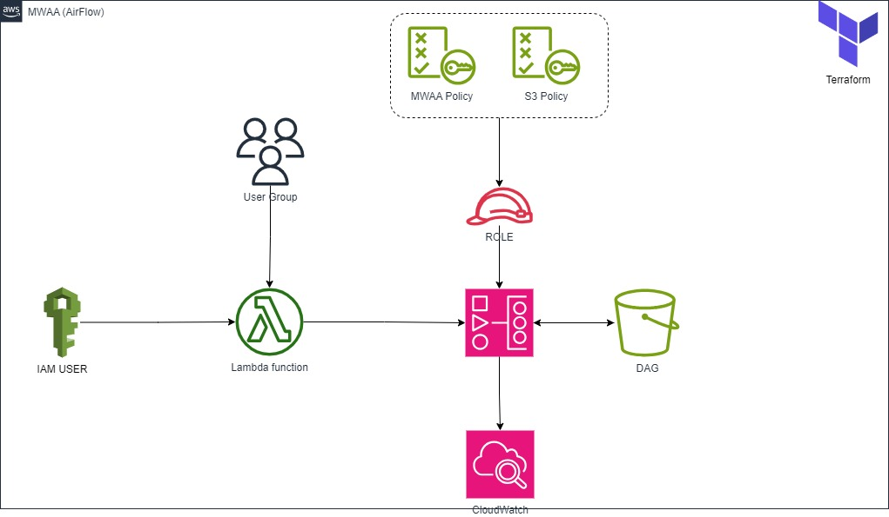

# Utilizando o Terraform para Subir uma instância de AWS MWAA(Air Flow) com isolamento de DAG

## Indice
- [Visão Geral](#visao)
- [Premissas](#premissa)
- [Visão Geral do AirFlow](./docs/airflow.md)
- [Visão Geral MWAA](./docs/mwaa.md)
- [Arquitetura sugerida](#arquitetura)
- [Como Utilizar este Repósitorio](#repositorio)
- [Links Documentações Utilizada](./docs/LinksUteis.md)
 
## Visão Geral

Precisei subir um ambiente de MWAA utilizando Terraform para alguns testes e me deparei com uma dificuldade em encontrar um código completo para subir um ambiente de teste, foi então que decidi construir este código.

A idéia é subir um ambiente MWAA com uma a [DAG](./docs/dag.md) que publica os metadados do Ambiente em um CloudWatch e com isoalamnto de a [DAG's](./docs/dag.md) por Grupos de Usuarios, ou seja cada grupo de usuario so pode ver as [DAG's](./docs/dag.md) setadas para eles.

## Premissas

- Cada Squad precisa ver apenas os seus Pipeline de dados
- Administradores devem conseguir ver todos os Pipes Lines de dados
- As métricas do ambiente precisam ser puplicadas em uma ferramenta de LOG
- Inicio, Fim e Falhas precisam ser puplicadas em uma ferramenta de LOG
- Ambiente que não precise o minimo de uma equipe de Infra estrutura  

## [Arquitetura sugerida](arquitetura)

  

## Como Utilizar este Repósitorio
